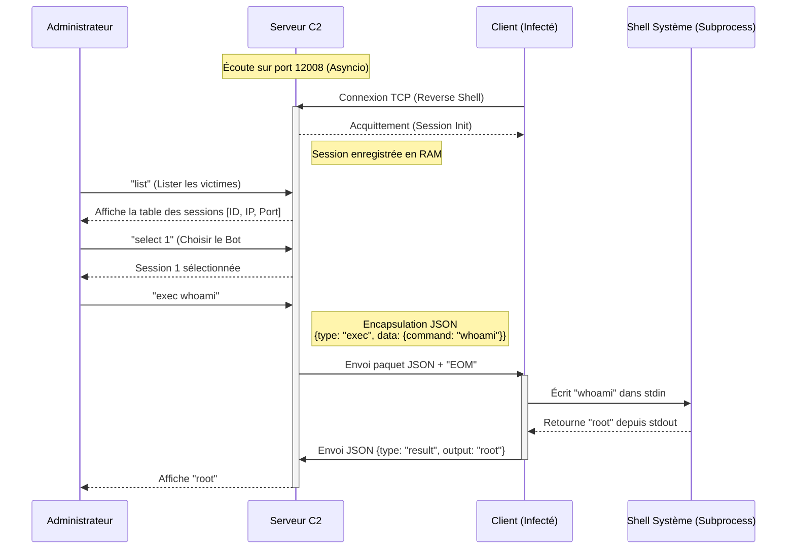
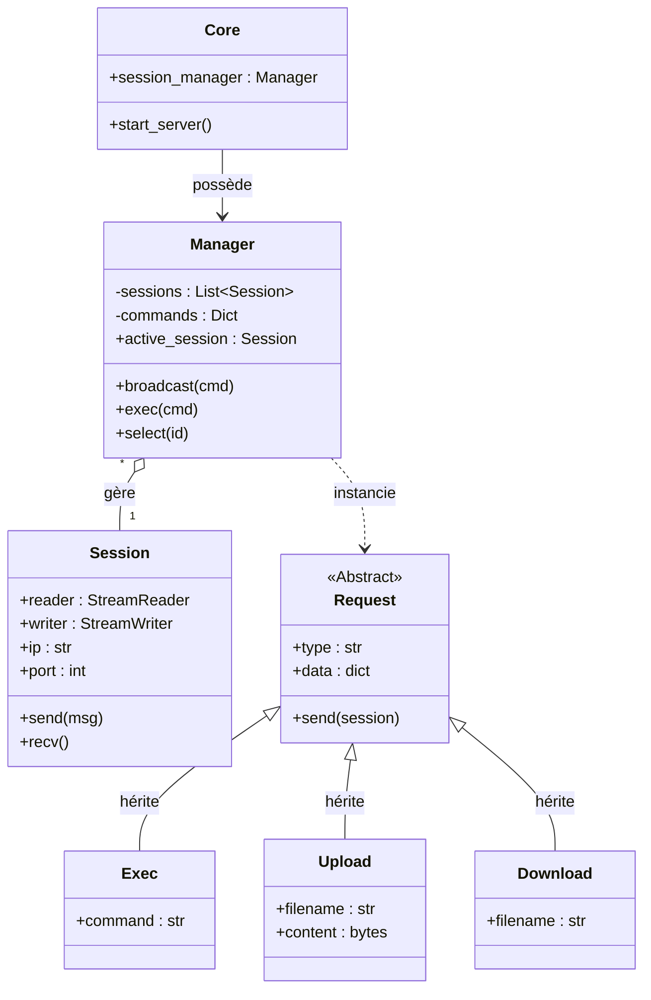

# Documentation de Projet : RS Manager

## Introduction et Fonctionnement

**rs_manager** est un système de "Command & Control" (C2) léger, développé en Python, conçu pour administrer un parc de machines (botnet) de manière centralisée et modulaire. Contrairement aux solutions lourdes reposant sur des bases de données SQL, **rs_manager** opère entièrement en mémoire vive (RAM), privilégiant la volatilité et la rapidité.

### Principe de Fonctionnement
L'application repose sur une architecture **Client-Serveur asynchrone** (via la bibliothèque `asyncio`).

1.  **Le Serveur (Le Cerveau)** : 
    - Il démarre une boucle d'événements asynchrone et écoute sur un port TCP défini (ex: 12008). 
    - Il agit comme une console d'administration interactive (CLI) pour l'attaquant.
    - Il gère simultanément les connexions de multiples clients sans bloquer, grâce au modèle de concurrence coopérative d'asyncio.

2.  **Le Client (L'Agent)** : 
    - Installé sur la machine cible, il initie la connexion vers le serveur (Reverse Shell), ce qui permet de contourner la plupart des pare-feux bloquant les connexions entrantes.
    - Il maintient un *subprocess* (sous-processus) shell (Bash ou CMD) ouvert en permanence. Cela permet une persistance du contexte : si l'on fait `cd /tmp` dans une commande, la commande suivante sera bien exécutée depuis `/tmp`.

3.  **La Communication** :
    - Les échanges se font via des sockets TCP bruts.
    - Pour structurer les données dans ce flux continu, un protocole personnalisé basé sur **JSON** est utilisé, délimité par une chaîne de caractères spéciale (`EOM` pour *End Of Message*).
    - Chaque message contient un `type` (ex: `exec`, `upload`) et des `data` (ex: la commande à lancer, le contenu du fichier).

---

## Modélisation du Système

### Diagramme de Séquence Système (DSS)
Ce diagramme illustre le flux d'interactions typique : de la connexion d'un bot à l'exécution d'une commande par l'administrateur.

### Diagramme de Classes Simplifié (Architecture Logicielle)
Ce diagramme montre comment le code est structuré, mettant en évidence l'utilisation du polymorphisme pour les requêtes et la centralisation par le Manager.

---

## Contexte et Apprentissages

### Contexte du Projet
Ce projet a été réalisé pour explorer les entrailles de la programmation réseau en Python. L'ambition était de sortir des frameworks web classiques (Django/Flask) pour manipuler des sockets bruts et comprendre comment structurer un protocole d'application "from scratch". C'était aussi l'occasion de se confronter aux problématiques de la programmation asynchrone, essentielle pour la performance des applications réseaux modernes.

### Apprentissages Techniques
1.  **Programmation Asynchrone (`asyncio`)** : 
    - Compréhension profonde de la boucle d'événements (Event Loop).
    - Gestion de la concurrence sans threads multiples (cooperative multitasking).
    - Synchronisation des tâches avec `asyncio.gather` et gestion des verrous implicites.

2.  **Protocoles Réseau & Sockets** :
    - Gestion de la fragmentation TCP : Les données n'arrivent pas toujours en un seul morceau. Implémentation d'un buffer de lecture qui attend le délimiteur `EOM`.
    - Design de protocole : Création d'un format de message robuste et extensible.

3.  **Architecture Modulaire** :
    - Utilisation de l'héritage et du polymorphisme pour traiter les différents types de commandes (`Exec`, `Download`, etc.) de manière uniforme.
    - Séparation nette entre la couche réseau (`Session`), la logique métier (`Manager`) et l'interface utilisateur.

4.  **Interaction Système Bas Niveau** :
    - Manipulation des pipes standards (`stdin`, `stdout`, `stderr`) via `subprocess` pour contrôler un shell interactif de manière programmatique.
